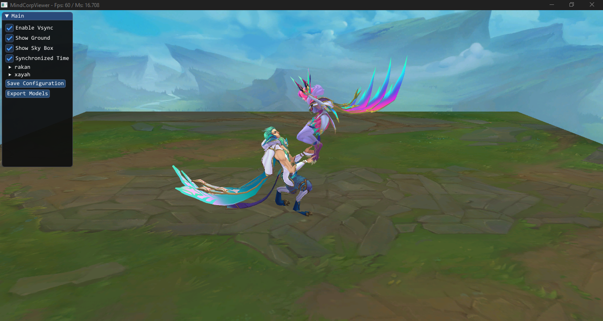

# MindCorpViewer
League Of Legends Model Viewer

# MOVED TO: https://github.com/autergame/MindCorpViewer-Rust

## Help From:
* https://github.com/Querijn/LeagueModel
* https://github.com/LoL-Fantome/LeagueToolkit
* https://github.com/CommunityDragon/CDTB
* https://github.com/DaveGamble/cJSON
* https://github.com/ocornut/imgui

## How to use: 
Extract skn, skl, animation folder and dds with: https://github.com/Crauzer/Obsidian and change in config.json

